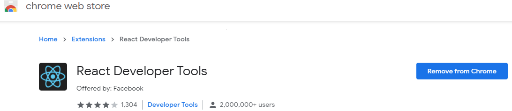

# React

사전체크 
```
npm --version 
```

## React Hooks
```
useState
useEffect

```
## beyond range
```
useContext
useReducer
useRef 
```


<p align="center">
<a url="https://www.aws.com/ivs">   </a>
</p>


### npx template 
```
npx create-react-app mart-app

cd mart-app

npm install redux react-redux 

//STORE -> GLOBALIZED STATE

//ACTION INCREMENT

// git 
```

### original 생성 
```
npm install react-redux
npm install -g create-react-app
npx create-react-app firstapp
cd firstapp
yarn start 
```

### Class
```
import React, { Component } from 'react'
class First extends Component {
    render() {
        return <h1>Class Component </h1>
    }
}

export default First 

```